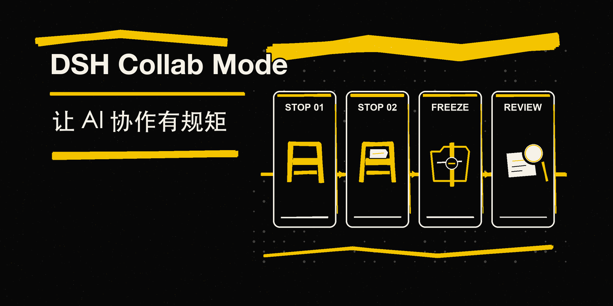
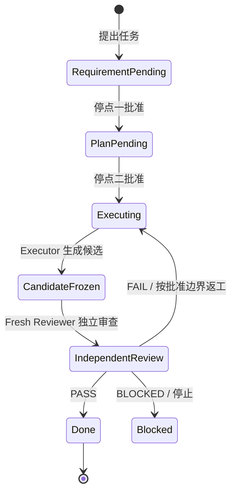
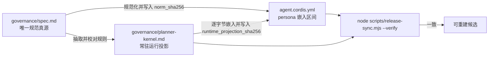
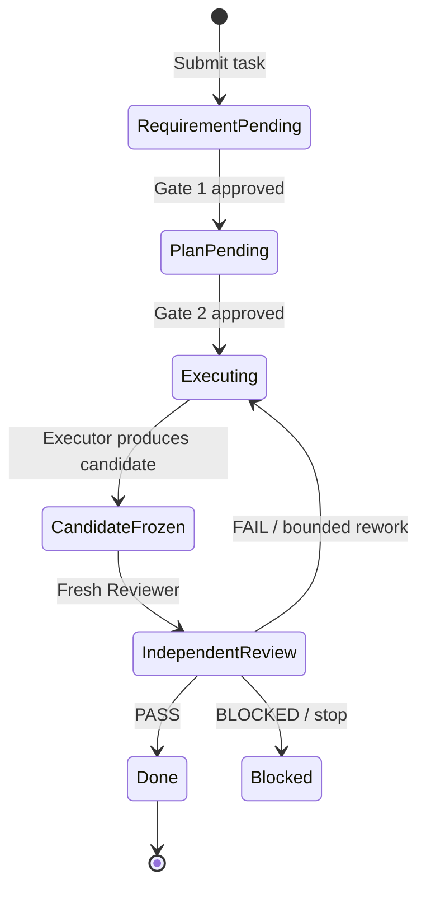
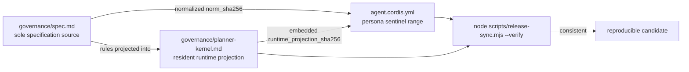

<p align="center">
  
</p>

<p align="center"><strong>让 Agent 协作可批准、可冻结、可复核。</strong></p>

<p align="center">
  <a href="https://github.com/a1270425803-bit/dsh-collab-mode/blob/main/LICENSE"></a>
  <a href="https://github.com/a1270425803-bit/dsh-collab-mode/releases"></a>
  <a href="https://github.com/a1270425803-bit/dsh-collab-mode"></a>
</p>

<p align="center">
  <a href="#中文">中文</a> · <a href="#english">English</a>
</p>

<a id="中文"></a>
# DSH 协作模式 v4.3 r2.1

> [安装](#安装) · [使用](#使用) · [原理](#原理) · [English](#english)

## 这是什么

`dsh-collab-mode` 是 DSH（DeepSeek Harness）的 Agent preset：把容易失控的 AI 协作，收敛成一条可追踪的轻量状态机。它用双停点批准明确“做什么”和“怎么做”，用不可移动的候选引用冻结交付，再交给全新上下文的 Reviewer 独立审查；任何一步不满足条件，就停止或回到批准边界内返工，而不是凭对话惯性继续推进。

## 演进历程

这套模式不是一次设计出来的，而是 2026 年 6 月起十次实战迭代的结果——从三个 CLI 窗口之间人工复制粘贴 prompt，到今天 DSH 里的自动化子 Agent 派发：

| 阶段 | 时间 | 形态 | 关键教训 |
|---|---|---|---|
| 纸面规则 | 6 月初–8/4 | v2.1 → v3.1 规则文档迭代：三窗口分责、强制落盘、子 Agent 辩论 | 没有机制约束的规则会被「顺手」打破 |
| CLI 互调 | 8/4–8/8 | 三个 CLI（Claude / Codex / Kimi）互相调用，人工复制粘贴 prompt 传递任务 | 人工传递可靠但费人；自动化编排器始终没接真实 CLI |
| 硬闸实验 | 8/8–8/11 | 自研 planner_gate：1747 行闸门 + 1127 行自测、逐文件批准账本、hash 防篡改 | 机制倒挂：闸门比业务重，真实试跑从未开始，4 天即弃 |
| 回归轻量 | 8/11 | 只留两停点 + 简单/复杂分支，安全边界交还宿主 sandbox | 确认应发生在计划级，而不是文件级 |
| CLI 跨端互派 | 8/13 | cross-terminal-dispatch：三端 CLI 命令互派，审查跨端派给不同模型 | 跨端的价值是异构审查，不让同一模型自圆其说 |
| DSH preset 化 | 8/14 | v4.0 迁入 DSH 用户级 preset：角色书内嵌 persona、16 技能、7 派发实例 | 规则从文档约定变成宿主可调用的真实工具 |
| v4.1–v4.3 硬化 | 8/15–8/17 | 治理状态机、常驻内核、对抗审查、候选冻结与内容寻址 | 状态要有唯一真源，批准要绑定版本与内容摘要 |
| R2 动态路由 | 8 月下旬 | 共享 route catalog：模型路由可注册、可核验 | 写死的路由会过期，注册制才能管住 |
| R2.1 直令路由 | 8 月底 | 直令指定模型 → 精确 route_id → route_bind_once 单次绑定 | 灵活性受控：直令即时生效，但不出注册表 |
| 开源 | 9/1 | r2.1 发布到本仓库 | 这套思想第一次离开本机 |

完整演进考古（含「加过又删」的 11 项机制、每次迭代的方案/执行/审查报告）保留在作者的私有档案库；本仓库是这条主线的现行开源形态。

## 这套思想不只属于 DSH

协作模式的内核是一套**与宿主无关的工程学纪律**，DSH 只是当前载体。迁移到任何支持子 Agent 的 harness（Claude Code、Codex、Kimi CLI、opencode……）时，真正要带走的是：

- **双停点**：需求和方案各确认一次，确认前不创建交付候选；
- **版本化状态真源**：一个工作区一份 CURRENT，批准绑定版本号与内容摘要，沉默和「继续」不算批准；
- **候选冻结**：交付物用内容寻址（commit hash / 逐文件 sha256）冻结，任何修改产生新候选；
- **Fresh Reviewer**：每轮审查都是全新上下文，禁止用执行者自己的结论充当验收；
- **止损纪律**：同根因最多两次、同周期最多三轮审查，到线就 BLOCKED 等人裁决，不靠换 Agent 改名重置。

CLI 时代这些纪律靠人工传递 prompt 执行；DSH 时代由 preset 自动派发执行。载体变了，纪律没变。

## 特性

- 🛑 **双停点批准**：先确认版本化需求，再确认方案、路由、范围与风险。
- 🔗 **版本绑定**：`task_id`、需求版本、方案版本与 `approval_cycle` 共同锁定当前执行。
- 🧊 **候选冻结**：用内容寻址的 `base_ref` 与 `candidate_ref` 描述可重建对象，避免“当前工作区”漂移。
- 🧪 **Fresh Reviewer 独立审查**：审查者从独立上下文读取候选，不接受执行者的推理辩护替代证据。
- 🔐 **SHA 链校验**：把规范、运行内核和 YAML 投影的关系固定下来，冲突时停止发布。
- 🧭 **绝对路径参数化**：`DSH_HOME` 缺省为 `~/.dsh`，catalog 路径在加载时解析为绝对路径。
- ♻️ **可复跑部署**：提供零依赖的 Node 校验脚本与 POSIX bootstrap 脚本，初始化目录并验证既有 catalog。

<a id="安装"></a>
## 安装

### 前置条件

- 已安装支持 v4.3 preset composition 的 DSH。
- Node.js 18 或更高版本。
- Git。

### 快速开始

1. **获取仓库**：

   ```sh
   git clone https://github.com/a1270425803-bit/dsh-collab-mode.git
   cd dsh-collab-mode
   ```

2. **设置 DSH_HOME 并准备 preset 目录**（不设置时使用 `~/.dsh`）：

   ```sh
   export DSH_HOME="${DSH_HOME:-$HOME/.dsh}"
   mkdir -p "$DSH_HOME/.agent-presets/collab-v43-r2-1"
   ```

3. **复制 preset 文件**：

   ```sh
   cp -R agent.cordis.yml preset.yml governance plugins scripts skills dsh-route-catalog \
     "$DSH_HOME/.agent-presets/collab-v43-r2-1/"
   ```

4. **初始化共享路由目录**：先用 dry-run 查看动作，再执行初始化。脚本会创建 `route-catalog/shared/`、`bindings/`、`snapshots/` 私有目录，并在缺失时创建受保护的 `catalog.json`；已有 catalog 只校验、不覆盖。

   ```sh
   sh scripts/bootstrap-catalog.sh --dry-run
   sh scripts/bootstrap-catalog.sh
   ```

5. **校验三处投影**：从已复制的 preset 根目录执行；命令只读检查 `spec.md`、`planner-kernel.md` 与 `agent.cordis.yml` 的 SHA 链和嵌入内容。

   ```sh
   cd "$DSH_HOME/.agent-presets/collab-v43-r2-1"
   node scripts/release-sync.mjs --verify
   ```

6. **在 DSH 中选择 preset**：选择 `协作模式 v4.3 r2.1`，然后按 DSH 的正常会话流程使用。

> `DSH_HOME` 可以指向自定义目录；preset 中的 `catalogDir` 会通过 `node:path.resolve` 将它解析为绝对路径。若校验失败，请停止部署，确认复制的是同一版本的文件，并从 preset 根目录重新运行 `node scripts/release-sync.mjs --verify`；不要绕过校验继续选择 preset。

<a id="使用"></a>
## 使用

一次协作按以下顺序推进：

1. **停点一：需求批准**。Planner 把目标、交付、范围、禁止项和验收写成版本化需求；未获明确批准，不创建交付候选。
2. **停点二：方案批准**。Planner 固定实现路线、模型路由、权限、风险、并行关系和停止条件；未获第二次明确批准，不进入执行。
3. **执行与冻结**。Executor 按任务书生产候选，记录命令和证据；Planner 冻结可重建的候选引用。
4. **独立审查**。Fresh Reviewer 对同一候选重跑验收并做风险相称的反例检查：`PASS` 才能进入完成路径，`FAIL` 在批准边界内返工，`BLOCKED` 则停止并返回 Planner 处理。



执行者只提交候选与证据，不自行宣布最终通过；最终状态由独立审查和 Planner 的状态记录共同决定。

<a id="原理"></a>
## 原理

### 三处投影与一条 SHA 链

- `governance/spec.md`：v4.3 的唯一规范真源。
- `governance/planner-kernel.md`：从规范中抽取的常驻运行投影，保留状态、批准、路由、证据与完成规则。
- `agent.cordis.yml`：把同一份 kernel 原文嵌入 persona 的哨兵区间，并在头部保存 `norm_sha256` 与 `runtime_projection_sha256`。

`scripts/release-sync.mjs` 会按 NFC、LF、去行尾空白和单一结尾换行规范化文本，再计算 UTF-8 SHA-256。默认模式负责同步；`--verify` 逐项比较规范哈希、kernel 哈希和 YAML 哨兵区间的逐字节内容，任一不一致都会以非零退出码停止。



### 路由目录

`bootstrap-catalog.sh` 使用 `DSH_HOME`（缺省 `~/.dsh`）初始化共享路由目录。目录和绑定/快照子目录为 `0700`，初始 `catalog.json` 为 `0600`，并带有自校验 digest；已有 catalog 不会被覆盖。

<a id="版本命名"></a>
## 版本命名说明

对外发布名是 **r2.1**；内核中的 `norm_version` 是 **collab-v4.3-r2.2**。这是历史命名差异：发布标签用于识别仓库交付，`norm_version` 用于识别内核规范版本，二者不代表两套不同的功能逻辑。

<a id="FAQ"></a>
## FAQ

**Q：为什么发布名是 r2.1，内核却写 r2.2？**  
A：这是已知的历史命名差异。部署完整性以 `node scripts/release-sync.mjs --verify` 的实际 SHA 校验为准，不要手工改写 `norm_version`。

**Q：可以把 DSH_HOME 放到别处吗？**  
A：可以。在复制 preset 和运行 `sh scripts/bootstrap-catalog.sh` 前导出自定义 `DSH_HOME`；它会被解析为绝对路径，缺省值仍是 `~/.dsh`。

**Q：catalog 已经存在时，bootstrap 会覆盖它吗？**  
A：不会。脚本会检查真实文件、权限、JSON 字段和 digest；校验不通过就停止，避免静默覆盖已有路由数据。

<a id="许可证"></a>
## License

本项目采用 [MIT License](LICENSE)。版权声明见 [`LICENSE`](LICENSE)。

## 致谢

感谢 DSH 及其协作模式的使用者与贡献者；本 preset 的目标是让 Agent 协作更容易理解、复现和审查。

---

<a id="english"></a>
# English

> [中文](#中文) · [Install](#install) · [Usage](#usage) · [How it works](#how-it-works)

## What is this?

`dsh-collab-mode` is the DSH (DeepSeek Harness) Agent preset for turning failure-prone AI collaboration into a traceable, lightweight state machine. Two approval gates clarify what to do and how to do it; immutable candidate references freeze the deliverable; a fresh Reviewer independently checks the same candidate. When a condition is not met, the process stops or returns for bounded rework instead of continuing on conversational momentum.

## Evolution

This preset was not designed in one sitting. It is the result of ten iterations since June 2026 — evolving from manually copy-pasting prompts between three CLI windows to automated subagent dispatch in DSH:

| Stage | Period | Form | Lesson |
|---|---|---|---|
| Paper rules | early Jun–Aug 4 | Rule-doc iterations v2.1 → v3.1: three-window split of duties, mandatory persistence, subagent debates | Rules without enforcement get broken "casually" |
| CLI relay | Aug 4–8 | Three CLIs (Claude / Codex / Kimi) calling each other, prompts relayed by hand | Manual relay works but costs human time; the orchestrator never touched a real CLI |
| Hard gate | Aug 8–11 | Self-built planner_gate: a 1,747-line gate with 1,127 lines of self-tests, per-file approval ledger, hash anti-tamper | Mechanism inversion: the gate outweighed the work; abandoned in 4 days |
| Back to lightweight | Aug 11 | Two approval gates + simple/complex branch; safety returned to the host sandbox | Approve at plan level, not file level |
| Cross-CLI dispatch | Aug 13 | cross-terminal-dispatch: three CLIs dispatch to each other; reviews sent to a different model | The value of crossing terminals is heterogeneous review |
| DSH preset | Aug 14 | v4.0 migrated into a DSH user-level preset: embedded personas, 16 skills, 7 dispatch instances | Rules became real host-callable tools |
| v4.1–v4.3 hardening | Aug 15–17 | Governance state machine, resident kernel, adversarial review, content-addressed freeze | One state source of truth; approvals bind version and digest |
| R2 dynamic routing | late Aug | Shared route catalog: routes registerable and verifiable | Hard-coded routes rot; registration keeps them honest |
| R2.1 direct-order routing | late Aug | Direct order → exact route_id → one-shot route_bind_once binding | Flexibility stays inside the registry |
| Open source | Sep 1 | r2.1 published in this repository | The ideas leave the author's machine |

The full archaeology (11 mechanisms that were added and later removed, plus the plan/execution/review reports of every iteration) is kept in the author's private archive; this repository is the current open-source form of that lineage.

## The ideas are not DSH-only

At its core, this collaboration mode is a set of **host-agnostic engineering disciplines**; DSH is just the current carrier. When migrating to any harness that supports subagents (Claude Code, Codex, Kimi CLI, opencode…), what you actually take with you is:

- **Two approval gates**: approve the requirement and the plan separately; no deliverable candidate exists before approval;
- **Versioned state truth**: one CURRENT per workspace; approvals bind to revision and content digest — silence or "continue" is not approval;
- **Candidate freeze**: deliverables are frozen by content addressing (commit hash / per-file sha256); any change produces a new candidate;
- **Fresh Reviewer**: every review round runs in a brand-new context; the executor's own conclusion never counts as acceptance;
- **Stop-loss discipline**: the same root cause gets at most two attempts, and each approval cycle at most three review rounds — then it is BLOCKED and waits for human judgment; renaming agents does not reset the count.

In the CLI era, these disciplines were executed by relaying prompts by hand; in the DSH era, the preset dispatches subagents automatically. The carrier changed; the disciplines did not.

## Features

- 🛑 **Two approval gates**: approve the versioned requirement first, then the plan, route, scope, and risk.
- 🔗 **Version binding**: lock the execution to `task_id`, requirement revision, plan revision, and `approval_cycle`.
- 🧊 **Candidate freeze**: use content-addressed `base_ref` and `candidate_ref` instead of a drifting working tree.
- 🧪 **Fresh Reviewer**: review from an independent context; execution-side reasoning is not a substitute for evidence.
- 🔐 **SHA-chain verification**: keep the specification, runtime kernel, and YAML projection consistent.
- 🧭 **Absolute-path configuration**: default `DSH_HOME` to `~/.dsh` and resolve the catalog path at load time.
- ♻️ **Repeatable deployment**: use the dependency-free Node verifier and POSIX bootstrap script to initialize and validate the catalog.

<a id="install"></a>
## Install and deploy

### Prerequisites

- A DSH runtime that supports the v4.3 preset composition.
- Node.js 18 or newer.
- Git.

### Quick start

1. **Clone the repository**:

   ```sh
   git clone https://github.com/a1270425803-bit/dsh-collab-mode.git
   cd dsh-collab-mode
   ```

2. **Set `DSH_HOME` and prepare the preset directory** (defaults to `~/.dsh`):

   ```sh
   export DSH_HOME="${DSH_HOME:-$HOME/.dsh}"
   mkdir -p "$DSH_HOME/.agent-presets/collab-v43-r2-1"
   ```

3. **Copy the preset files**:

   ```sh
   cp -R agent.cordis.yml preset.yml governance plugins scripts skills dsh-route-catalog \
     "$DSH_HOME/.agent-presets/collab-v43-r2-1/"
   ```

4. **Initialize the shared route catalog**:

   ```sh
   sh scripts/bootstrap-catalog.sh --dry-run
   sh scripts/bootstrap-catalog.sh
   ```

   The script creates private `route-catalog/shared/`, `bindings/`, and `snapshots/` directories and creates a protected `catalog.json` only when it is absent. An existing catalog is validated, not overwritten.

5. **Verify the three projections** from the copied preset root:

   ```sh
   cd "$DSH_HOME/.agent-presets/collab-v43-r2-1"
   node scripts/release-sync.mjs --verify
   ```

6. **Select the preset in DSH**: choose `协作模式 v4.3 r2.1` and continue with a normal DSH session.

> `DSH_HOME` may point to a custom directory. `catalogDir` uses `node:path.resolve` to turn it into an absolute path. If verification fails, stop deployment, confirm that all files come from the same release, and rerun `node scripts/release-sync.mjs --verify` from the preset root; do not bypass verification.

<a id="usage"></a>
## Usage

1. **Requirement gate**: Planner records the goal, deliverables, scope, prohibitions, and acceptance criteria as a versioned requirement and waits for explicit approval.
2. **Plan gate**: Planner fixes the route, model, permissions, risk, parallel structure, and stop conditions and waits for the second explicit approval.
3. **Execute and freeze**: Executor produces a candidate and evidence under the taskbook; Planner freezes a reproducible candidate reference.
4. **Review independently**: a fresh Reviewer reruns acceptance and a risk-proportionate counterexample check. `PASS` enters the completion path, `FAIL` triggers bounded rework, and `BLOCKED` stops for Planner handling.



The Executor submits candidates and evidence only; it does not declare the final result.

<a id="how-it-works"></a>
## How it works

### Three projections, one SHA chain

- `governance/spec.md` is the sole v4.3 specification source.
- `governance/planner-kernel.md` is the resident runtime projection containing the state, approval, routing, evidence, and completion rules.
- `agent.cordis.yml` embeds the same kernel text inside the persona sentinel range and stores `norm_sha256` plus `runtime_projection_sha256` in its header.

`scripts/release-sync.mjs` normalizes text as NFC, LF, no trailing whitespace, and exactly one final newline before computing UTF-8 SHA-256 values. Its default mode synchronizes; `--verify` compares the specification hash, kernel hash, and embedded YAML bytes and exits nonzero on any mismatch.



### Route catalog

`scripts/bootstrap-catalog.sh` uses `DSH_HOME` (default `~/.dsh`) to initialize the shared route catalog. The directories and binding/snapshot subdirectories are `0700`; the initial `catalog.json` is `0600` and carries a self-checking digest. Existing catalogs are never overwritten.

<a id="version-naming"></a>
## Version naming

The public release name is **r2.1**, while the kernel `norm_version` is **collab-v4.3-r2.2**. This is a known historical naming difference: the release label identifies the repository delivery, while `norm_version` identifies the kernel specification version. They do not represent two different feature sets.

<a id="faq"></a>
## FAQ

**Q: Why does the release say r2.1 while the kernel says r2.2?**  
A: It is a historical naming difference. Trust the actual integrity check, `node scripts/release-sync.mjs --verify`, rather than editing `norm_version` by hand.

**Q: Can I use a custom DSH_HOME?**  
A: Yes. Export it before copying the preset and running `sh scripts/bootstrap-catalog.sh`; it is resolved to an absolute path. The default remains `~/.dsh`.

**Q: Will bootstrap overwrite an existing catalog?**  
A: No. It validates the real file, permissions, JSON fields, and digest, then stops on invalid data rather than silently overwriting route data.

<a id="license"></a>
## License

This project is released under the [MIT License](LICENSE). See [`LICENSE`](LICENSE) for the copyright and permission notice.

## Acknowledgements

Thanks to DSH and the users and contributors of collaborative Agent workflows. This preset is designed to make Agent collaboration easier to understand, reproduce, and review.
